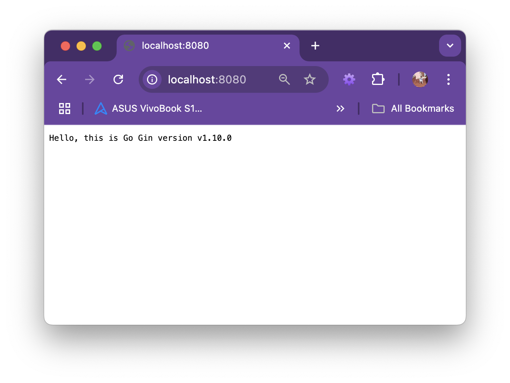
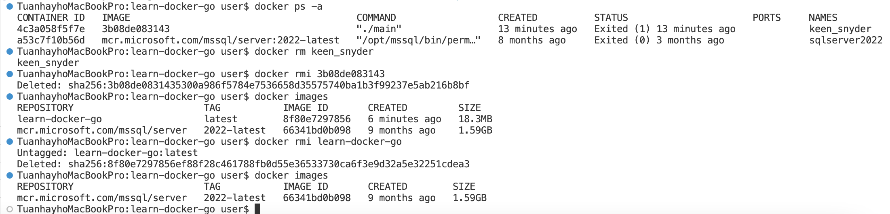
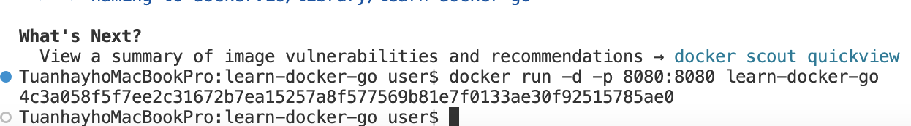
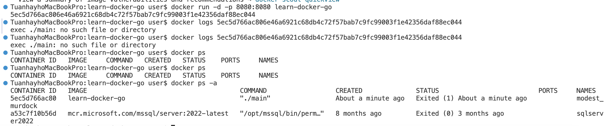
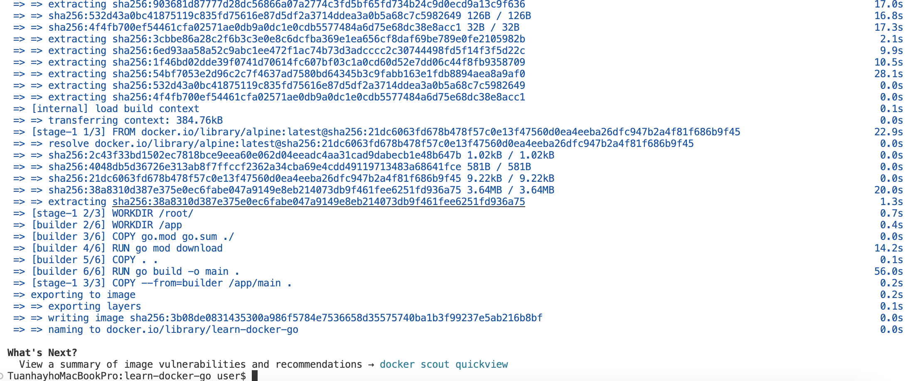
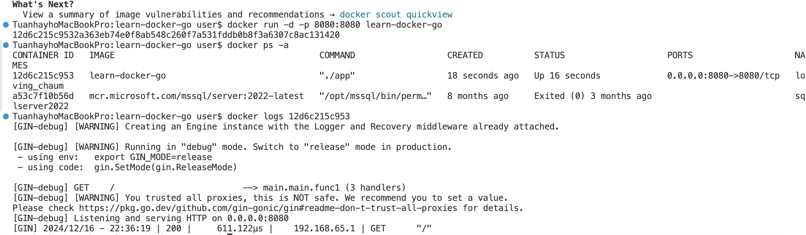
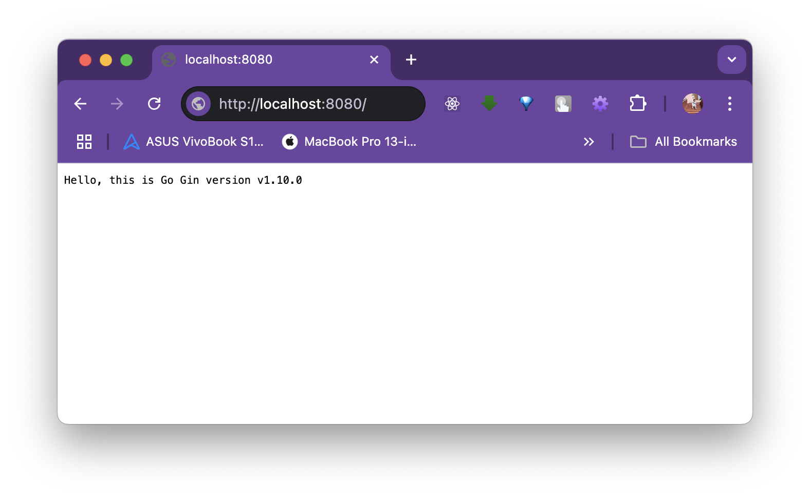
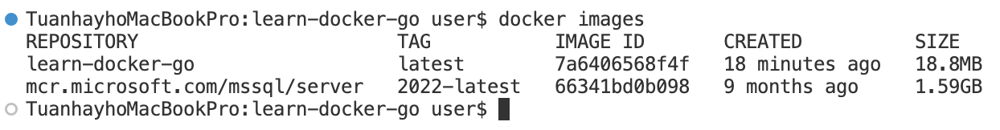

## Step 1: Create the Folder and Initialize the Go Project
Create the folder and navigate to it:

```bash
mkdir learn-docker-go
cd learn-docker-go
```
Initialize a new Go module for the project:

```bash
go mod init github.com/yourusername/learn-docker-go
````

Step 2: Write the Go Code
Create a file named main.go in the learn-docker-go folder with the following content:

```go
package main

import (
	"fmt"
	"github.com/gin-gonic/gin"
)

func main() {
	// Create a new Gin router
	r := gin.Default()

	// Define the index route
	r.GET("/", func(c *gin.Context) {
		c.String(200, fmt.Sprintf("Hello, this is Go Gin version %s", gin.Version))
	})

	// Start the HTTP server on port 8080
	r.Run(":8080")
}
```

#### Fetch the needed libraries:
```sh
go get
```

## Step 3: Test the Application
#### Run the Go application locally to ensure it works:

```bash
go run main.go
```

Visit http://localhost:8080 in your browser. You should see:

```sh
Hello, this is Go Gin version x.x.x
```


## Step 4: Write a Dockerfile
#### Create a file named Dockerfile in the learn-docker-go folder with the following content:

```Dockerfile
# Use the official Go image as the base image
FROM golang:1.21 as builder

# Set the working directory inside the container
WORKDIR /app

# Copy the Go module files
COPY go.mod go.sum ./

# Download the dependencies
RUN go mod download

# Copy the source code
COPY . .

# Build the application
RUN go build -o main .

# Use a minimal base image for the final container
FROM alpine:latest

# Set the working directory inside the container
WORKDIR /root/

# Copy the built binary from the builder stage
COPY --from=builder /app/main .

# Expose port 8080
EXPOSE 8080

# Run the application
CMD ["./main"]
```

## Step 5: Create a .dockerignore File
#### Create a file named .dockerignore in the learn-docker-go folder to exclude unnecessary files from the build context:

```bash
# Exclude the local Go build cache and other unneeded files
/go
*.log
*.tmp
.idea
.vscode
```

## Step 6: Build and Run the Docker Image
#### Build the Docker image:

```bash
docker build -t learn-docker-go .
```
### Run the Docker container:

```bash
docker run -d -p 8080:8080 learn-docker-go
```
#### Visit http://localhost:8080 in your browser to see:

```bash
Hello, this is Go Gin version x.x.x
```


#### Result: app not found on browser when visiting "http://localhost:8080"
[built-app-not-found.png]

### Fix the Issue
Modify your main.go file to bind the Gin server to 0.0.0.0 instead of localhost:

```go
r.Run("0.0.0.0:8080")
```
This allows the server to listen on all available network interfaces, making it accessible from outside the container.

### Remove the faulty container:


### Steps to Apply the Fix
#### 1. Update the Code Update the main.go file as mentioned above.

#### 2. Rebuild the Docker Image Rebuild the Docker image to include the updated code:

```bash
docker build -t learn-docker-go .
```
#### 3. Restart the Container Stop the old container and start a new one:

Start new one
```bash
docker run -d -p 8080:8080 learn-docker-go
```
Replace <container-id> with the ID of the old container (4c3a058f5f7e in your case).

#### 4. Verify Visit http://localhost:8080 in your browser. You should now see:

```bash
Hello, this is Go Gin version x.x.x
```
### Result: still cannot find on browser

==> It returned (exited) immediately
Check build log:



The error message exec ./main: no such file or directory indicates that the main binary is not being found or is not properly built in the container. This likely means that the go build step inside the Dockerfile did not create the binary in the expected location.

Let's go through the steps to fix the issue:

### 1. Ensure Proper Build in Dockerfile
The issue might be caused by the way the binary is built or copied in the Dockerfile. We want to make sure the Go binary is built and copied correctly from the build stage to the final stage.

#### Let's review and update the Dockerfile:

```Dockerfile
ARG GO_VERSION=1.21

FROM golang:${GO_VERSION}-alpine AS builder

RUN apk update && apk add alpine-sdk git && rm -rf /var/cache/apk/*

RUN mkdir -p /api
WORKDIR /api

COPY go.mod .
COPY go.sum .
RUN go mod download

COPY . .
RUN go build -o ./app main.go

FROM alpine:latest

RUN apk update && apk add ca-certificates && rm -rf /var/cache/apk/*

RUN mkdir -p /api
WORKDIR /api
COPY --from=builder /api/app .

EXPOSE 8080

ENTRYPOINT ["./app"]
```

### 2. Rebuild the Docker Image
After updating the Dockerfile, rebuild the Docker image:

```bash
docker build -t learn-docker-go .
```

#### The new Dockerfile script's building progress with go mod download
[new-dockerfile-script-build-progress.png]

#### build done:


### 3. Run the Container Again
Now, run the container again:

```bash
docker run -d -p 8080:8080 learn-docker-go
```

### Success result




#### app image size:


#### to stop the running container:
```bash
docker stop 12d6c215c953
```
"12d6c215c953" is CONTAINER ID


## Key Changes and Why They Work
### 1. Package Installation in Builder Stage:

RUN apk update && apk add alpine-sdk git && rm -rf /var/cache/apk/*:
This ensures that the necessary build tools (like git and alpine-sdk) are installed in the builder stage to compile your Go code, which might include fetching dependencies from external repositories.

### 2. Explicit Build Directory:

RUN mkdir -p /api and WORKDIR /api:
By explicitly creating a working directory (/api), you ensure that the source files are copied into the correct location, and the build is performed in the right context.

### 3. Copying Go Modules First:

COPY go.mod . and COPY go.sum .:
This is a good practice because it allows Docker to leverage its cache when downloading dependencies. By copying the Go modules first, Docker can reuse the layer that installs dependencies without needing to download them again unless go.mod or go.sum changes.

### 4. Build and Copy the Binary:

RUN go build -o ./app main.go:
This step correctly builds the app binary from main.go in the builder stage.

### 5. Final Stage Setup:

In the final stage, you copy the built binary (/api/app) from the builder container, which ensures that only the compiled binary and necessary runtime dependencies (like ca-certificates) are included in the final image.

### 6. ENTRYPOINT:

ENTRYPOINT ["./app"] ensures that the container will run your application when it starts.